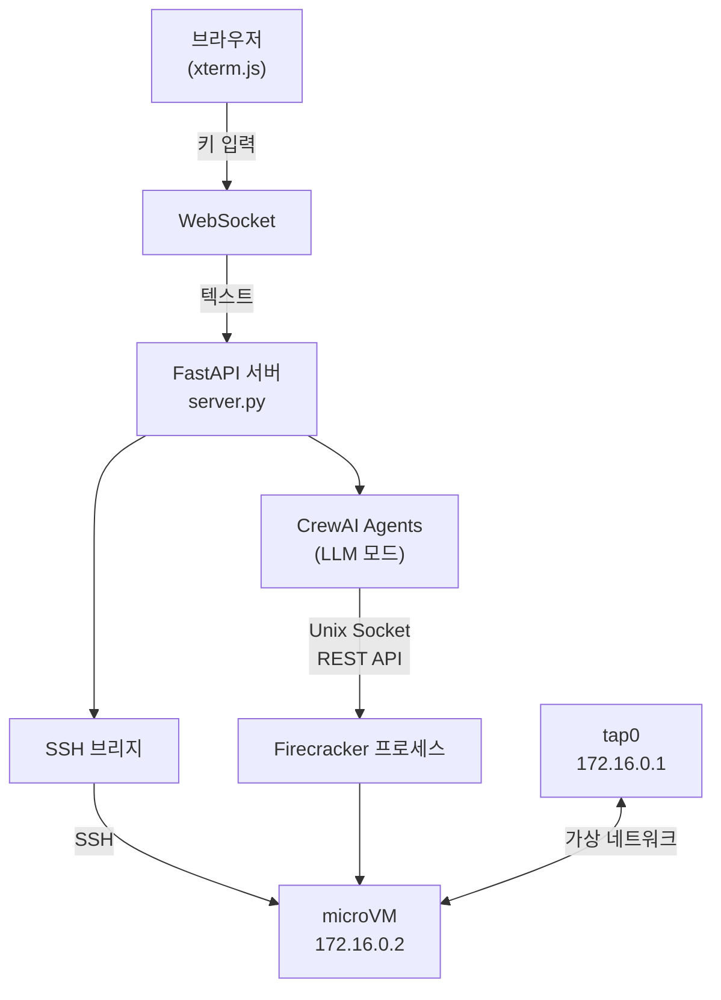
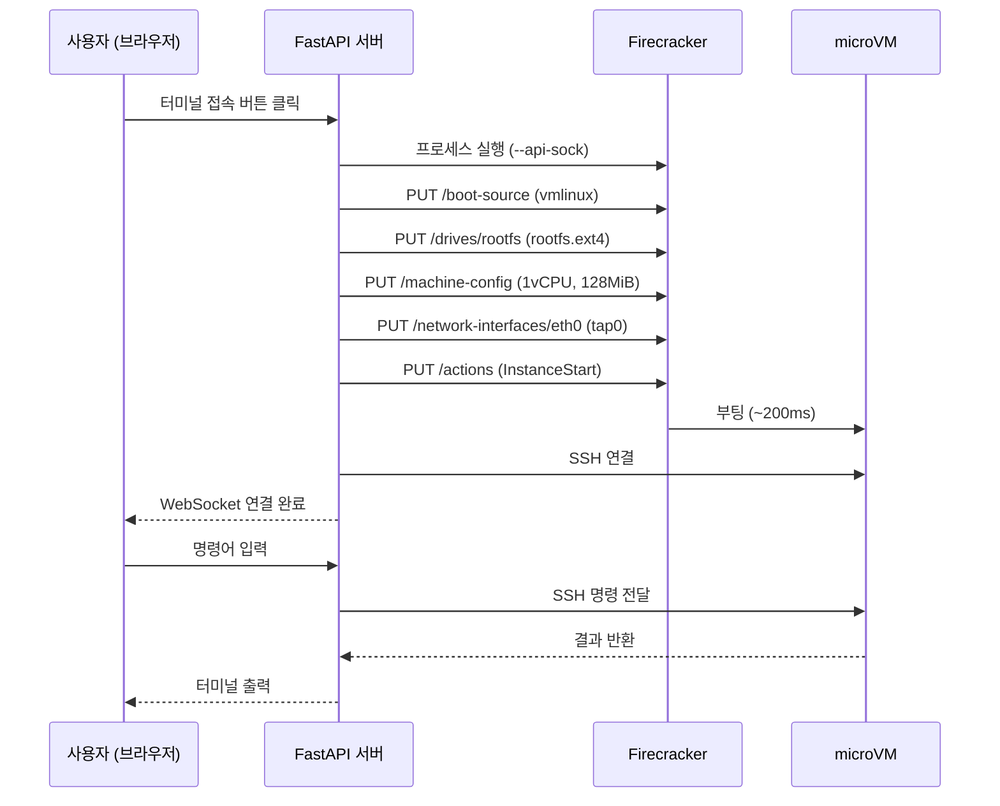

# Firecracker with Agent

Firecracker microVM을 CrewAI Agent로 제어하고, 브라우저 웹 터미널로 접속하는 샌드박스 환경.

---

## 화면 캡처


---

## 개념도

```
┌─────────────────────────────────────────────────────────────────┐
│  브라우저                                                        │
│                                                                 │
│  ┌─────────────────────────────────────────────────────────┐   │
│  │  xterm.js 터미널                                         │   │
│  │  키 입력 ──────────────────────────────────────────────► │   │
│  │           ◄────────────────────────────────── 출력       │   │
│  └───────────────────────┬─────────────────────────────────┘   │
└──────────────────────────┼──────────────────────────────────────┘
                           │ WebSocket
┌──────────────────────────┼──────────────────────────────────────┐
│  Linux (Ubuntu)          │                                      │
│                          ▼                                      │
│  ┌───────────────────────────────────────────────────────────┐  │
│  │  FastAPI 서버 (server.py)                                 │  │
│  │                                                           │  │
│  │  ┌─────────────────┐   ┌────────────────────────────┐    │  │
│  │  │  CrewAI Agents  │   │  WebSocket ↔ SSH 브리지     │    │  │
│  │  │  - VM Manager   │   │  (샌드박스 모드)            │    │  │
│  │  │  - Test Runner  │   └──────────────┬─────────────┘    │  │
│  │  │  - Analyzer     │                  │ SSH               │  │
│  │  └────────┬────────┘                  │                   │  │
│  │           │ Unix Socket               │                   │  │
│  └───────────┼───────────────────────────┼───────────────────┘  │
│              │                           │                      │
│              ▼                           ▼                      │
│  ┌───────────────────────────────────────────────────────────┐  │
│  │  Firecracker 프로세스                                     │  │
│  │                                                           │  │
│  │  ┌─────────────────────────────────────────────────────┐  │  │
│  │  │  microVM (KVM)                                      │  │  │
│  │  │  kernel: vmlinux  │  rootfs: ubuntu-18.04.ext4      │  │  │
│  │  │  IP: 172.16.0.2   │  SSH 서버 (port 22)             │  │  │
│  │  └─────────────────────────────────────────────────────┘  │  │
│  │                                                           │  │
│  │  tap0 (172.16.0.1) ←──── 가상 네트워크 ──────► VM eth0   │  │
│  └───────────────────────────────────────────────────────────┘  │
└─────────────────────────────────────────────────────────────────┘
```

---

## 아키텍처 흐름



---

## VM 부팅 흐름



---

## 프로젝트 구조

```
firecracker-with-agent/
├── server.py                # FastAPI 서버 (웹 터미널 + WebSocket)
├── crew.py                  # CrewAI CLI (LLM 모드 / 샌드박스 모드)
├── tasks.py                 # CrewAI Task 정의
├── requirements.txt
├── .env                     # GEMINI_API_KEY
│
├── agents/
│   ├── vm_manager.py        # VM 시작/종료 Agent
│   ├── test_runner.py       # 명령 실행 Agent
│   └── result_analyzer.py   # 결과 분석 Agent
│
├── tools/
│   ├── firecracker_api.py   # Firecracker Unix Socket REST 클라이언트
│   ├── vm_config.py         # VM 설정 dataclass
│   ├── vm_process.py        # Firecracker 프로세스 실행/종료
│   ├── ssh_executor.py      # paramiko SSH 실행기
│   └── crewai_tools.py      # CrewAI BaseTool 래핑
│
├── resources/
│   ├── vmlinux              # Linux 커널 바이너리
│   └── rootfs.ext4          # Ubuntu 18.04 루트 파일시스템
│
├── scripts/
│   └── setup_network.sh     # TAP 네트워크 설정
│
├── static/
│   └── index.html           # xterm.js 웹 터미널 UI
│
└── docs/
    ├── plan.md
    ├── 01-environment.md
    ├── 02-api-client.md
    ├── 03-boot-test.md
    ├── 04-crewai-tools.md
    ├── 05-agents.md
    └── 06-web-ui.md
```

---

## 실행 방법 (Linux)

### 1. 사전 요구사항

```bash
# KVM 사용 가능 여부 확인
ls /dev/kvm && echo "KVM OK"

# Firecracker 설치
ARCH=$(uname -m)
VERSION="v1.7.0"
wget "https://github.com/firecracker-microvm/firecracker/releases/download/${VERSION}/firecracker-${VERSION}-${ARCH}.tgz"
tar -xvf firecracker-${VERSION}-${ARCH}.tgz
sudo mv release-${VERSION}-${ARCH}/firecracker-${VERSION}-${ARCH} /usr/local/bin/firecracker
sudo chmod +x /usr/local/bin/firecracker
```

### 2. 저장소 클론

```bash
git clone https://github.com/<your-org>/firecracker-with-agent.git
cd firecracker-with-agent
```

### 3. 커널 및 rootfs 다운로드

```bash
mkdir -p resources && cd resources

wget "https://s3.amazonaws.com/spec.ccfc.min/img/quickstart_guide/x86_64/kernels/vmlinux.bin" -O vmlinux
wget "https://s3.amazonaws.com/spec.ccfc.min/img/quickstart_guide/x86_64/rootfs/bionic.rootfs.ext4" -O rootfs.ext4

cd ..
```

### 4. Python 환경 설정

```bash
python3 -m venv .venv
source .venv/bin/activate
pip install -r requirements.txt
```

### 5. SSH 키 생성 및 rootfs에 주입

```bash
ssh-keygen -t rsa -b 4096 -f ~/.ssh/firecracker_key -N ""

mkdir -p /tmp/rootfs-mount
sudo mount -o loop resources/rootfs.ext4 /tmp/rootfs-mount
sudo mkdir -p /tmp/rootfs-mount/root/.ssh
sudo cp ~/.ssh/firecracker_key.pub /tmp/rootfs-mount/root/.ssh/authorized_keys
sudo chmod 600 /tmp/rootfs-mount/root/.ssh/authorized_keys
sudo umount /tmp/rootfs-mount
```

### 6. TAP 네트워크 설정

```bash
sudo apt install -y iptables
chmod +x scripts/setup_network.sh
sudo ./scripts/setup_network.sh
```

> WSL2 재시작 시 네트워크가 초기화되므로 작업 시작마다 재실행 필요.

### 7. 환경변수 설정

프로젝트 루트에 `.env` 파일을 생성한다. (`.gitignore`에 포함되어 있어 커밋되지 않음)

```bash
cp .env.example .env
```

또는 직접 생성:

```bash
cat > .env << 'EOF'
GEMINI_API_KEY=your-gemini-api-key-here
EOF
```

#### 환경변수 목록

| 키 | 필수 | 설명 |
|----|------|------|
| `GEMINI_API_KEY` | 필수 | Google AI Studio에서 발급. LLM 모드에서 사용 |

> Gemini API 키 발급: [Google AI Studio](https://aistudio.google.com/app/apikey)
>
> 웹 터미널(샌드박스) 모드만 사용할 경우 API 키 없이도 동작한다.

### 8. 웹 서버 실행

```bash
python server.py
```

브라우저에서 `http://localhost:8000` 접속 후 `[터미널 접속]` 버튼 클릭.

---

## CLI 실행 (선택)

```bash
# 샌드박스 모드 (직접 명령 입력)
python crew.py 2

# LLM 모드 (자연어로 요청)
python crew.py 1
```

---

## 기술 스택

| 항목 | 선택 |
|------|------|
| VM 엔진 | Firecracker v1.7.0 |
| Agent 프레임워크 | CrewAI |
| LLM | Gemini 2.0 Flash |
| 웹 서버 | FastAPI + uvicorn |
| 터미널 UI | xterm.js |
| SSH | paramiko |
| 네트워크 | TAP (tap0) + iptables NAT |

---

## 참고

- [Firecracker GitHub](https://github.com/firecracker-microvm/firecracker)
- [Kata Containers with Firecracker](https://github.com/kata-containers/kata-containers/blob/main/docs/how-to/how-to-use-kata-containers-with-firecracker.md)
